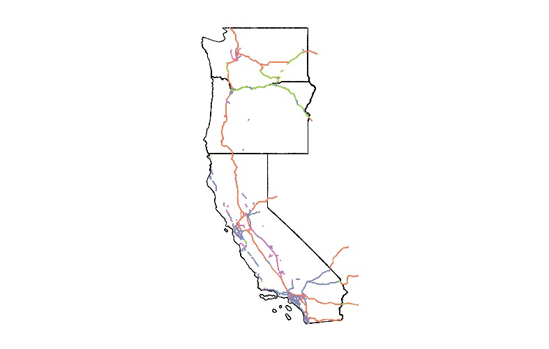
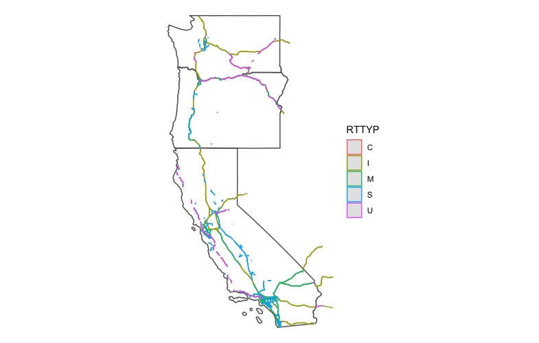

Almost every time I try to stack geometries when plotting `{sf}` objects I try to use the syntax below. This doesn't seem to work, and doesn't throw any errors. I don't understand why.

```r
library(sf)

nz <- spData::nz
nz_height <- spData::nz_height

plot(nz[0])
plot(nz_height[0], add = T)
```

I've found the only way to plot geometries on the same plot is to use `st_geometry` within the plot function. `st_geometry` function extracts the geometry from the `sf` object. In the code below I've styled the map to better distinguish the points from the polygons.

```r
plot(st_geometry(nz[nz$Island == 'South', ]), col = '#9a00fa', border = '#c871ff')
plot(st_geometry(nz_height), col = 'mediumspringgreen', cex = 1.5, add = T)
```
What about coloring elements in the geometry based an attribute? Let's use some new data too. I've used the `{tigris}` package to download some US Census data. 

```r
library(sf)
us_states <- tigris::states(class = 'sf')
us_west <- us_states[us_states$NAME %in% c('Washington', 'Oregon', 'California'), ]

roads <- tigris::primary_roads(class = 'sf')
roads <- roads[us_west, ]

plot(st_geometry(us_west))
plot(roads['RTTYP'], add = T)
```



Although, you'll need to check the order of the you plot the geometries. I can't figure out why this happens. Maybe it is just an issue with my install of R or `{sf}`.

```r
plot(roads['RTTYP'])
plot(st_geometry(us_west), add = T)
```


I need to experiment more with base R plotting to figure this out. 

## {ggplot2}

I generally plot using `{ggplot2}`, and the best thing about `{sf}` is that it includes methods to plot spatial objects with `{ggplot2}`. As much as I plot with `{ggplot2}`, I haven't used it very frequently with `{sf}` objects. If you are used to plotting in `{ggplot}` it shouldn't be too different than what you're used to.

```r
library(ggplot2)

ggplot() +
  geom_sf(data = us_west, fill = NA) +
  geom_sf(data = roads, aes(color = RTTYP)) +
  coord_sf() +
  theme_void()
```



Pretty much any of the methods you would use with `{ggplot2}`. 

## Easy Interactive Maps

One last tip for this post. The `{mapview}` library has a great general purpose mapping function, `mapview`. It will plot `{sf}` objects as an interactive Leaflet map. If you provide the name of a column in the function call, `mapview(us_states['NAME'])` it'll color the states just like base R plotting of `{sf}` objects. As an added bonus, the `mapview` function will add popups and tooltips to the map. Super handy! I genuinely love this function because it helps me avoid using ArcMap or QGIS to quickly visualize shapefiles. 

```r
library(mapview)

# doesn't color states, includes all attributes in popup
mapview(us_west)

# colors states based on provided attribute,
# doesn't include all attributes in popup
mapview(us_west['NAME'])
```

## Alternatives

There are a few plotting alternatives, but those mentioned above are the simplest. `{tmap}`, or thematic maps, provides a `{ggplot2}` like interface for plotting. The `{leaflet}` library is a wrapper for the Leaflet javascript library. It is more complicated than using the `{mapview}` library, but it is more customizable. 

There you have it, a few different methods of plotting spatial data in R. While not a comprehensive tutorial on visualizing spatial data, it should be enough to get started. And it will help me remember to use `st_geometry` when plotting `{sf}` objects.